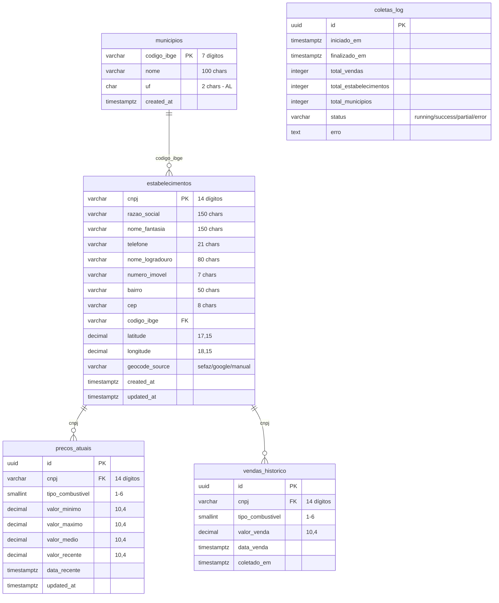
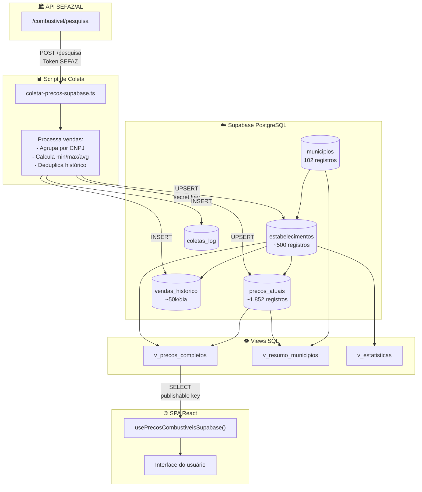
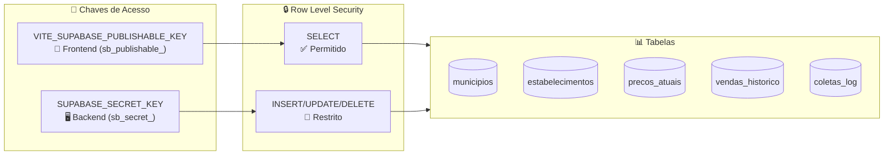

# Configuração do Supabase para o Litrômetro

Este guia explica como configurar o Supabase para conectar a aplicação Litrômetro.

## 1. Criar Projeto no Supabase

1. Acesse [supabase.com](https://supabase.com) e faça login
2. Clique em **New Project**
3. Preencha os dados:
   - **Name**: `litrometro` (ou outro nome de sua preferência)
   - **Database Password**: Crie uma senha forte (guarde-a!)
   - **Region**: Escolha a região mais próxima (ex: `South America (São Paulo)`)
4. Clique em **Create new project** e aguarde a criação (~2 minutos)

---

## 2. Criar as Tabelas

O schema v2.0 utiliza 5 tabelas normalizadas:

| Tabela | Descrição | Registros esperados |
|--------|-----------|---------------------|
| `municipios` | Municípios de Alagoas | 102 |
| `estabelecimentos` | Postos de combustível | ~500 |
| `precos_atuais` | Preços atuais por posto/combustível | ~1.852 |
| `vendas_historico` | Histórico de vendas | ~10k-50k/dia |
| `coletas_log` | Log de execuções de coleta | N |

### Passo a passo:

1. No menu lateral, vá em **SQL Editor**
2. Clique em **New query**
3. Cole o conteúdo do arquivo `supabase/schema.sql` deste projeto
4. Clique em **Run** para executar

### Seed dos municípios:

Após criar as tabelas, execute também o `supabase/seed.sql` para popular os 102 municípios de Alagoas.

---

## 3. Obter as Credenciais

### 3.1 Para o Frontend (chave pública)

1. No menu lateral, vá em **Project Settings** (ícone de engrenagem)
2. Clique em **API** no submenu
3. Copie os valores:

| Campo | Descrição |
|-------|-----------|
| **Project URL** | URL do projeto (ex: `https://xxxxx.supabase.co`) |
| **publishable** | Chave pública para o frontend (prefixo `sb_publishable_`) |

### 3.2 Para o Script de Coleta (chave privada)

Na mesma página de API, copie também:

| Campo | Descrição |
|-------|-----------|
| **secret** | Chave privada para o backend (prefixo `sb_secret_`) |

### 3.3 Sobre as Chaves

| Chave | Variável | Prefixo | Uso | Segurança |
|-------|----------|---------|-----|-----------|
| **publishable** | `VITE_SUPABASE_PUBLISHABLE_KEY` | `sb_publishable_` | Frontend React | ✅ Pode ser exposta |
| **secret** | `SUPABASE_SECRET_KEY` | `sb_secret_` | Scripts backend, GitHub Actions | 🔐 **NUNCA** exponha no frontend |

**Características das API Keys:**
- ✅ Rotação instantânea
- ✅ Auditoria de uso
- ✅ Múltiplas secret keys por projeto
- ✅ Escopo granular

> ⚠️ **Importante**: A chave `secret` **bypassa** as políticas RLS (Row Level Security), 
> tendo acesso total ao banco de dados. Use apenas em:
> - Scripts de coleta (servidor/CI)
> - Edge Functions
> - GitHub Actions
> - Nunca no código do frontend!

---

## 4. Configurar Variáveis de Ambiente

### 4.1 Desenvolvimento Local

Crie um arquivo `.env` na raiz do projeto (copie do `.env.example`):

```bash
# Supabase
VITE_SUPABASE_URL=https://seu-projeto.supabase.co
VITE_SUPABASE_PUBLISHABLE_KEY=sb_publishable_sua_chave_aqui
SUPABASE_SECRET_KEY=sb_secret_sua_chave_aqui

# SEFAZ
SEFAZ_APP_TOKEN=seu-token-sefaz-aqui
```

### 4.2 GitHub Actions (Produção)

Configure os **Secrets** no repositório GitHub:

1. Vá no repositório → **Settings** → **Secrets and variables** → **Actions**
2. Clique em **New repository secret**
3. Adicione os seguintes secrets:

| Secret Name | Valor |
|-------------|-------|
| `VITE_SUPABASE_URL` | URL do projeto Supabase |
| `SUPABASE_SECRET_KEY` | Secret key (prefixo `sb_secret_`) |
| `SEFAZ_APP_TOKEN` | Token da API SEFAZ/AL |

### 4.3 Deploy do Frontend (Vercel/Netlify)

Configure as variáveis de ambiente no painel do serviço de deploy:

| Variável | Valor |
|----------|-------|
| `VITE_SUPABASE_URL` | URL do projeto Supabase |
| `VITE_SUPABASE_PUBLISHABLE_KEY` | Publishable key (prefixo `sb_publishable_`) |

---

## 5. Estrutura do Schema (v2.0)

### Diagrama ER (Entity-Relationship)



### Fluxo de Dados



### Tipos de Combustível

| Código | Nome | Descrição |
|--------|------|-----------|
| 1 | Gasolina Comum | Gasolina regular |
| 2 | Gasolina Aditivada | Gasolina com aditivos |
| 3 | Etanol | Álcool/Etanol hidratado |
| 4 | Diesel Comum | Diesel S500 |
| 5 | Diesel S10 | Diesel com baixo enxofre |
| 6 | GNV | Gás Natural Veicular |

### Tabela `municipios`
| Campo | Tipo | Descrição |
|-------|------|-----------|
| `codigo_ibge` | VARCHAR(7) | **PK** - Código IBGE |
| `nome` | VARCHAR(100) | Nome do município |
| `uf` | CHAR(2) | UF (padrão: AL) |

### Tabela `estabelecimentos`
| Campo | Tipo | Descrição |
|-------|------|-----------|
| `cnpj` | VARCHAR(14) | **PK** - CNPJ do posto |
| `razao_social` | VARCHAR(150) | Nome oficial |
| `nome_fantasia` | VARCHAR(150) | Nome comercial |
| `codigo_ibge` | VARCHAR(7) | **FK** → municipios |
| `latitude` | DECIMAL(17,15) | Coordenada |
| `longitude` | DECIMAL(18,15) | Coordenada |
| `geocode_source` | VARCHAR(20) | sefaz/google/manual |

### Tabela `precos_atuais`
| Campo | Tipo | Descrição |
|-------|------|-----------|
| `id` | UUID | **PK** automático |
| `cnpj` | VARCHAR(14) | **FK** → estabelecimentos |
| `tipo_combustivel` | SMALLINT | 1-6 (gasolina, diesel, etc) |
| `valor_minimo` | DECIMAL(10,4) | Min dos últimos 10 dias |
| `valor_maximo` | DECIMAL(10,4) | Max dos últimos 10 dias |
| `valor_medio` | DECIMAL(10,4) | Média dos últimos 10 dias |
| `valor_recente` | DECIMAL(10,4) | Última venda |
| `data_recente` | TIMESTAMPTZ | Data da última venda |

### Tabela `vendas_historico`
| Campo | Tipo | Descrição |
|-------|------|-----------|
| `id` | UUID | **PK** automático |
| `cnpj` | VARCHAR(14) | **FK** → estabelecimentos |
| `tipo_combustivel` | SMALLINT | Tipo do combustível |
| `valor_venda` | DECIMAL(10,4) | Valor da venda |
| `data_venda` | TIMESTAMPTZ | Timestamp exato |

### Tabela `coletas_log`
| Campo | Tipo | Descrição |
|-------|------|-----------|
| `id` | UUID | **PK** |
| `iniciado_em` | TIMESTAMPTZ | Início da coleta |
| `finalizado_em` | TIMESTAMPTZ | Fim da coleta |
| `status` | VARCHAR(20) | running/success/partial/error |
| `total_vendas` | INTEGER | Vendas processadas |

### Views disponíveis

- `v_precos_completos` - Preços com dados do estabelecimento (substitui atual.json)
- `v_resumo_municipios` - Resumo por município (substitui municipios/*.json)
- `v_estatisticas` - Estatísticas gerais

---

## 6. Políticas de Segurança (RLS)



### Como funciona

Todas as tabelas usam Row Level Security (RLS):

- **Com `publishable` key** (frontend): Respeita RLS → só pode SELECT
- **Com `secret` key** (backend): **Bypassa RLS** → acesso total

### Políticas Criadas

#### Leitura Pública
```sql
CREATE POLICY "Leitura pública" ON nome_tabela FOR SELECT USING (true);
```
→ Qualquer pessoa pode ler os dados (necessário para o frontend)

#### Escrita Restrita
```sql
CREATE POLICY "Escrita restrita" ON nome_tabela FOR ALL 
  USING (auth.role() = 'service_role');
```
→ Apenas o script de coleta (usando `SUPABASE_SECRET_KEY`) pode inserir/atualizar

### Uso no Script de Coleta

```typescript
// scripts/coletar-precos-supabase.ts
import { createClient } from '@supabase/supabase-js';

// Usa secret key para bypasser RLS e ter acesso de escrita
const supabase = createClient(
  process.env.VITE_SUPABASE_URL!,
  process.env.SUPABASE_SECRET_KEY!,  // ⚠️ Apenas em backend!
  {
    db: { schema: 'public' },
    auth: { 
      autoRefreshToken: false,
      persistSession: false 
    },
  }
);

// Agora pode fazer INSERT/UPDATE
await supabase.from('estabelecimentos').upsert(dados);
```

---

## 7. Testando a Conexão

### Frontend
```bash
make dev
```
Abra o navegador e verifique se os dados carregam.

### Script de Coleta (JSON)
```bash
make collect
```
Coleta dados e salva em arquivos JSON (modo fallback).

### Script de Coleta (Supabase)
```bash
make collect-supabase
```
Coleta dados e salva diretamente no Supabase.

---

## 8. Monitoramento

### Verificar Dados no Supabase

1. No menu lateral, vá em **Table Editor**
2. Selecione a tabela `precos_combustiveis`
3. Visualize os registros inseridos

### Logs de API

1. Vá em **Logs** → **API**
2. Monitore as requisições ao banco de dados

### Métricas de Uso

1. Vá em **Reports** → **Database**
2. Acompanhe queries, conexões e performance

---

## 9. Limites do Plano Gratuito

O Supabase Free Tier inclui:

- ✅ 500 MB de banco de dados
- ✅ 1 GB de bandwidth/mês
- ✅ 50.000 requisições de autenticação/mês
- ✅ 50 MB de storage
- ⚠️ Pausa após 7 dias de inatividade (reativa automaticamente)

Para produção com alto volume, considere o plano Pro ($25/mês).

---

## Troubleshooting

### Erro: "relation 'precos_combustiveis' does not exist"
→ Execute o SQL do schema no SQL Editor

### Erro: "new row violates row-level security policy"
→ Verifique se está usando a `SUPABASE_SECRET_KEY` no script de coleta

### Erro: "Invalid API key"
→ Confira se as variáveis de ambiente estão corretas (prefixo `sb_publishable_` ou `sb_secret_`)

### Dados não aparecem no frontend
→ Verifique se a política de leitura pública foi criada
