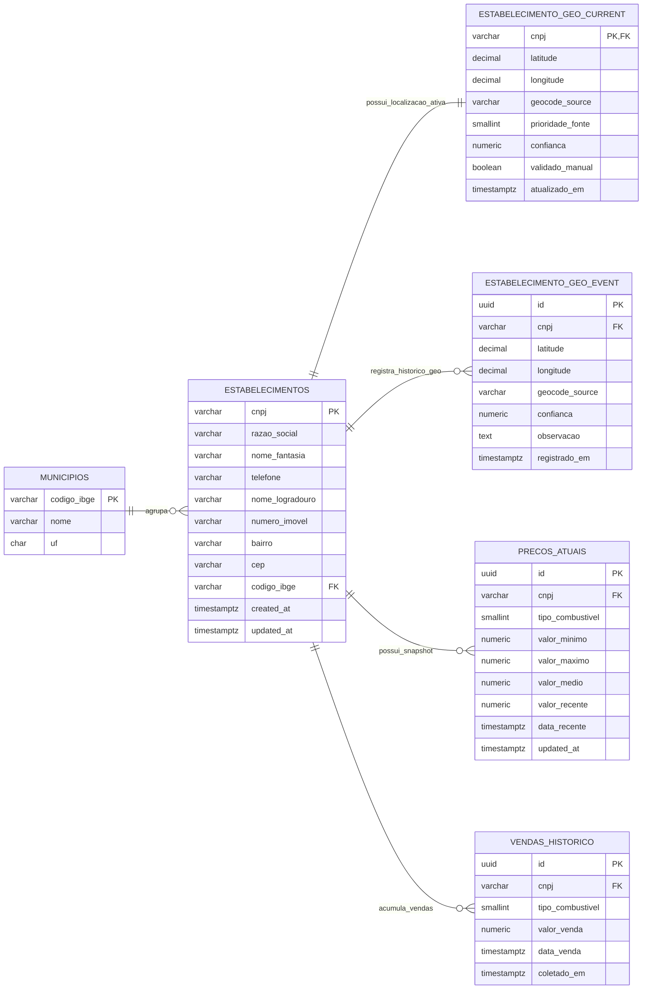
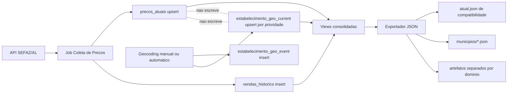

# Plano de Evolucao de Dados e Pipeline

## Objetivo

Este documento detalha a proposta de evolucao da arquitetura de dados do Litrômetro para reduzir conflitos entre:

- coleta de precos
- correcao e validacao de coordenadas
- exportacao de arquivos JSON publicados
- armazenamento de historico

O objetivo central e separar responsabilidades de escrita por dominio, para que cada processo atualize apenas seu proprio conjunto de dados.

---

## Problema Atual

Hoje o pipeline tem tres caracteristicas que aumentam a chance de conflito:

1. O cadastro do estabelecimento e a geografia ficam acoplados na mesma tabela logica e na mesma exportacao final.
2. A exportacao publica gera arquivos consolidados grandes, como [public/dados/atual.json](/home/celosauro/projects/litrometro/public/dados/atual.json), que sao alterados por qualquer mudanca de preco ou coordenada.
3. O processo de geocoding e o processo de coleta podem influenciar o mesmo conjunto final de arquivos, o que favorece conflitos durante pull, merge e regeneracao dos dados.

Os sintomas mais visiveis sao:

- conflitos recorrentes nos JSONs gerados em [public/dados](/home/celosauro/projects/litrometro/public/dados)
- dificuldade para preservar coordenadas validadas manualmente
- acoplamento entre historico, preco atual e dados cadastrais
- aumento do risco de sobrescrita acidental de latitude e longitude

---

## Principios da Solucao

1. Coleta de preco nao altera geografia.
2. Geocodificacao nao altera preco.
3. Exportacao apenas le dados consolidados e publica artefatos.
4. Historico e snapshot atual ficam fisicamente separados.
5. Views e artefatos de exportacao fazem a composicao para consumo do frontend.

---

## Arquitetura Alvo

### Separacao por dominio

- `municipios`: dimensao administrativa
- `estabelecimentos`: identidade e cadastro do posto
- `estabelecimento_geo_current`: coordenada atual consolidada por CNPJ
- `estabelecimento_geo_event`: trilha de auditoria das alteracoes de coordenada
- `precos_atuais`: snapshot atual por estabelecimento e tipo de combustivel
- `vendas_historico`: historico append-only de vendas coletadas
- `coletas_log`: auditoria operacional

### Resultado pratico

- um ajuste de coordenada nao exige reprocessar historico
- uma nova coleta de preco nao toca em latitude e longitude
- a exportacao passa a ser o unico ponto de composicao
- conflitos ficam concentrados em artefatos gerados, nao no dado-fonte

---

## Diagrama de Dados



### Leitura do diagrama

- `estabelecimentos` deixa de ser responsavel por armazenar a coordenada definitiva.
- `estabelecimento_geo_current` passa a ser a fonte oficial da localizacao atual.
- `estabelecimento_geo_event` guarda a trilha historica das mudancas de latitude e longitude.
- `precos_atuais` continua com a foto atual para busca rapida.
- `vendas_historico` fica isolada como base append-only.

---

## Diagrama de Pipeline



### Regras operacionais

1. O job de coleta escreve apenas em `precos_atuais` e `vendas_historico`.
2. O job de geocoding escreve apenas em `estabelecimento_geo_current` e `estabelecimento_geo_event`.
3. O exportador le as views consolidadas e gera os JSONs publicados.
4. O frontend continua consumindo artefatos estaticos, sem depender de mudanca imediata no runtime.

---

## Alteracoes SQL Propostas

O schema atual em [supabase/schema.sql](/home/celosauro/projects/litrometro/supabase/schema.sql) ja contem boa parte da separacao entre cadastro, preco atual e historico. A principal evolucao agora e retirar a geografia consolidada de dentro de `estabelecimentos` como fonte oficial.

### 1. Manter `estabelecimentos` como cadastro

Tabela atual:

- manter `cnpj`, dados de endereco, telefone e municipio
- manter `latitude`, `longitude` e `geocode_source` apenas durante a transicao
- no estado final, essas colunas podem ser removidas ou tratadas como legado

No alvo:

- `estabelecimentos` representa identidade e cadastro
- `estabelecimento_geo_current` representa a localizacao ativa

### 2. Criar tabela de localizacao atual

```sql
create table if not exists estabelecimento_geo_current (
  cnpj varchar(14) primary key references estabelecimentos(cnpj) on delete cascade,
  latitude decimal(17, 15) not null,
  longitude decimal(18, 15) not null,
  geocode_source varchar(30) not null,
  prioridade_fonte smallint not null default 0,
  confianca numeric(5, 4),
  validado_manual boolean not null default false,
  observacao text,
  atualizado_em timestamptz not null default now()
);

create index if not exists idx_geo_current_source
  on estabelecimento_geo_current(geocode_source);
```

Motivacao:

- separa a coordenada atual do cadastro base
- permite definir precedencia entre fontes
- evita sobrescrita indevida por coletor de preco

### 3. Criar tabela de eventos de geocoding

```sql
create table if not exists estabelecimento_geo_event (
  id uuid primary key default gen_random_uuid(),
  cnpj varchar(14) not null references estabelecimentos(cnpj) on delete cascade,
  latitude decimal(17, 15) not null,
  longitude decimal(18, 15) not null,
  geocode_source varchar(30) not null,
  confianca numeric(5, 4),
  observacao text,
  registrado_em timestamptz not null default now()
);

create index if not exists idx_geo_event_cnpj_data
  on estabelecimento_geo_event(cnpj, registrado_em desc);
```

Motivacao:

- cria trilha de auditoria para cada correcao de coordenada
- ajuda a explicar por que um CNPJ mudou de posicao
- permite reavaliar regressao ou conflito de fonte

### 4. Backfill da geografia atual

```sql
insert into estabelecimento_geo_current (
  cnpj,
  latitude,
  longitude,
  geocode_source,
  prioridade_fonte,
  validado_manual,
  atualizado_em
)
select
  cnpj,
  latitude,
  longitude,
  coalesce(geocode_source, 'sefaz'),
  case
    when geocode_source = 'manual' then 100
    when geocode_source = 'google-maps-poi' then 90
    when geocode_source = 'google-maps-search' then 70
    when geocode_source = 'opencage' then 60
    when geocode_source = 'nominatim' then 50
    else 10
  end,
  (geocode_source = 'manual'),
  now()
from estabelecimentos
where latitude is not null and longitude is not null
on conflict (cnpj) do update
set latitude = excluded.latitude,
    longitude = excluded.longitude,
    geocode_source = excluded.geocode_source,
    prioridade_fonte = excluded.prioridade_fonte,
    validado_manual = excluded.validado_manual,
    atualizado_em = excluded.atualizado_em;
```

Motivacao:

- move o estado atual sem ruptura
- permite migrar exportacao antes de limpar colunas antigas

### 5. Funcao para upsert protegido por prioridade

```sql
create or replace function upsert_estabelecimento_geo(
  p_cnpj varchar(14),
  p_lat decimal(17, 15),
  p_lng decimal(18, 15),
  p_source varchar(30),
  p_prioridade smallint,
  p_confianca numeric(5, 4),
  p_obs text
) returns void as $$
begin
  insert into estabelecimento_geo_event (
    cnpj,
    latitude,
    longitude,
    geocode_source,
    confianca,
    observacao
  ) values (
    p_cnpj,
    p_lat,
    p_lng,
    p_source,
    p_confianca,
    p_obs
  );

  insert into estabelecimento_geo_current (
    cnpj,
    latitude,
    longitude,
    geocode_source,
    prioridade_fonte,
    confianca,
    observacao,
    atualizado_em
  ) values (
    p_cnpj,
    p_lat,
    p_lng,
    p_source,
    p_prioridade,
    p_confianca,
    p_obs,
    now()
  )
  on conflict (cnpj) do update
  set latitude = excluded.latitude,
      longitude = excluded.longitude,
      geocode_source = excluded.geocode_source,
      prioridade_fonte = excluded.prioridade_fonte,
      confianca = excluded.confianca,
      observacao = excluded.observacao,
      atualizado_em = excluded.atualizado_em
  where excluded.prioridade_fonte >= estabelecimento_geo_current.prioridade_fonte;
end;
$$ language plpgsql;
```

Motivacao:

- impede que uma fonte mais fraca sobrescreva uma fonte validada
- formaliza a regra de precedencia no banco
- padroniza o caminho de escrita da geografia

### 6. Criar view consolidada v2

```sql
create or replace view v_precos_completos_v2 as
select
  e.cnpj,
  p.tipo_combustivel,
  e.razao_social,
  e.nome_fantasia,
  e.telefone,
  e.nome_logradouro,
  e.numero_imovel,
  e.bairro,
  e.cep,
  e.codigo_ibge,
  m.nome as municipio,
  g.latitude,
  g.longitude,
  g.geocode_source,
  p.valor_minimo,
  p.valor_maximo,
  p.valor_medio,
  p.valor_recente,
  p.data_recente,
  p.updated_at
from precos_atuais p
join estabelecimentos e on e.cnpj = p.cnpj
join municipios m on m.codigo_ibge = e.codigo_ibge
left join estabelecimento_geo_current g on g.cnpj = e.cnpj;
```

Motivacao:

- preserva o contrato de leitura do exportador
- desloca a fonte da coordenada para a nova camada de geografia
- reduz o impacto de mudanca no frontend e nos scripts

### 7. Evoluir historico para particionamento

O historico ja esta separado em `vendas_historico`, o que esta correto. A melhoria recomendada e particionar por `data_venda` quando o volume crescer o suficiente.

Exemplo:

```sql
create table if not exists vendas_historico_v2 (
  id uuid default gen_random_uuid(),
  cnpj varchar(14) not null references estabelecimentos(cnpj) on delete cascade,
  tipo_combustivel smallint not null check (tipo_combustivel between 1 and 6),
  valor_venda decimal(10, 4) not null,
  data_venda timestamptz not null,
  coletado_em timestamptz not null default now(),
  primary key (id, data_venda),
  unique (cnpj, tipo_combustivel, data_venda, valor_venda)
) partition by range (data_venda);
```

Motivacao:

- melhora manutencao de historico longo
- reduz custo de consulta, limpeza e arquivamento
- facilita exportacao por periodo

---

## Alteracoes nos Scripts

### [scripts/coletar-precos-supabase.ts](/home/celosauro/projects/litrometro/scripts/coletar-precos-supabase.ts)

Alteracao proposta:

- parar de tratar `latitude`, `longitude` e `geocode_source` como campo de escrita principal
- manter coleta focada em:
  - cadastro minimo do estabelecimento
  - `precos_atuais`
  - `vendas_historico`

No futuro:

- se a SEFAZ fornecer coordenada nova, isso entra apenas como evento de baixa prioridade na camada geo
- nao deve sobrescrever `estabelecimento_geo_current` se houver fonte melhor

### [scripts/sync-geocache-supabase.ts](/home/celosauro/projects/litrometro/scripts/sync-geocache-supabase.ts)

Alteracao proposta:

- trocar `update` direto em `estabelecimentos` por chamada da funcao `upsert_estabelecimento_geo(...)`
- registrar cada correcao como evento
- consolidar a localizacao atual apenas quando a nova fonte vencer por prioridade

### [scripts/exportar-json.ts](/home/celosauro/projects/litrometro/scripts/exportar-json.ts)

Alteracao proposta:

- migrar leitura de `v_precos_completos` para `v_precos_completos_v2`
- manter geracao de [public/dados/atual.json](/home/celosauro/projects/litrometro/public/dados/atual.json) por compatibilidade
- opcionalmente adicionar artefatos separados, por exemplo:
  - `public/dados/estabelecimentos.json`
  - `public/dados/precos-atuais.json`
  - `public/dados/historico/` por particao de periodo

---

## Modelo de Publicacao Recomendado

Para reduzir conflitos de merge nos arquivos gerados, ha duas estrategias possiveis.

### Opcao A: manter arquivos atuais, mas serializar pipeline

- coletar precos
- atualizar geografia
- exportar JSON
- commitar artefatos ao final

Vantagem:

- menor ruptura

Limite:

- ainda existe chance de conflito nos arquivos gerados se dois fluxos rodarem em paralelo

### Opcao B: publicar snapshots versionados

Estrutura sugerida:

- `public/dados/manifest.json`
- `public/dados/snapshots/2026-04-24T10-40-53Z/atual.json`
- `public/dados/snapshots/2026-04-24T10-40-53Z/municipios/*.json`

O frontend le o manifesto para descobrir a versao ativa.

Vantagem:

- reduz muito conflitos em artefato fixo
- melhora rollback de publicacao
- separa dado publicado de dado em geracao

---

## Plano de Migracao

### Fase 1: preparacao de schema

1. Criar `estabelecimento_geo_current`
2. Criar `estabelecimento_geo_event`
3. Criar funcao `upsert_estabelecimento_geo`
4. Fazer backfill a partir de `estabelecimentos`
5. Criar `v_precos_completos_v2`

Resultado esperado:

- nenhuma mudanca ainda no frontend
- exportador e scripts continuam funcionando com possibilidade de migracao gradual

### Fase 2: adaptar scripts

1. Ajustar coletor para nao sobrescrever coordenadas consolidadas
2. Ajustar sync do geocache para usar a funcao de upsert protegida
3. Ajustar exportador para ler a view v2

Resultado esperado:

- escrita separada por dominio
- eliminacao do principal vetor de conflito entre preco e geografia

### Fase 3: separar artefatos publicados

1. Introduzir artefatos JSON por dominio
2. Manter `atual.json` como camada de compatibilidade
3. Opcionalmente adotar `manifest.json` com snapshots versionados

Resultado esperado:

- reducao de conflito em arquivos grandes
- melhor controle de deploy e rollback

### Fase 4: limpeza estrutural

1. Parar de usar `latitude`, `longitude` e `geocode_source` em `estabelecimentos` como fonte de verdade
2. Opcionalmente remover essas colunas no schema final
3. Particionar historico se volume justificar

Resultado esperado:

- modelo final simplificado e mais robusto

---

## Impacto Esperado

### Ganhos

- menos conflito de merge em dados gerados
- menor risco de perda de coordenadas validadas
- trilha de auditoria para geocoding
- pipeline mais facil de operar e debugar
- melhor escalabilidade para historico

### Custos

- nova migracao SQL
- ajuste de scripts existentes
- periodo curto de compatibilidade dupla durante a transicao

---

## Recomendacao de Aprovacao

Antes de implementar, vale aprovar estes pontos:

1. geografia passa a ter camada propria e fonte oficial separada
2. `atual.json` continua existindo durante a transicao
3. historico permanece separado e com possibilidade de particionamento
4. exportacao passa a ser o unico ponto de composicao dos dados publicados
5. snapshots versionados entram agora ou ficam para uma segunda etapa

Com essa aprovacao, a implementacao pode comecar pela Fase 1 sem quebrar o frontend atual.

---

## Status da Implementacao

Primeira etapa ja aplicada no codigo:

1. Schema evoluido em [supabase/schema.sql](/home/celosauro/projects/litrometro/supabase/schema.sql)
2. Exportacao com fallback de view e artefatos separados em [scripts/exportar-json.ts](/home/celosauro/projects/litrometro/scripts/exportar-json.ts)
3. Sync de geocache com uso de funcao de upsert e fallback legado em [scripts/sync-geocache-supabase.ts](/home/celosauro/projects/litrometro/scripts/sync-geocache-supabase.ts)
4. Coleta preservando coordenadas existentes em [scripts/coletar-precos-supabase.ts](/home/celosauro/projects/litrometro/scripts/coletar-precos-supabase.ts)

Migracao incremental pronta para execucao no Supabase:

- [supabase/migration_20260424_pipeline_evolution.sql](/home/celosauro/projects/litrometro/supabase/migration_20260424_pipeline_evolution.sql)

Etapa seguinte ativada:

1. Exportador agora exige `v_precos_completos_v2` (fallback legado removido)
2. Sync de geocache agora exige `upsert_estabelecimento_geo` (fallback em `estabelecimentos` removido)
3. Validacao executada em runtime:
  - `npm run export:json` usando v2 com sucesso
  - `npm run sync:geocache` usando RPC com sucesso (0 erros)